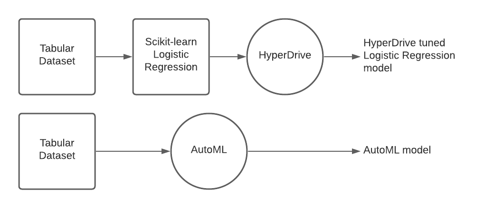
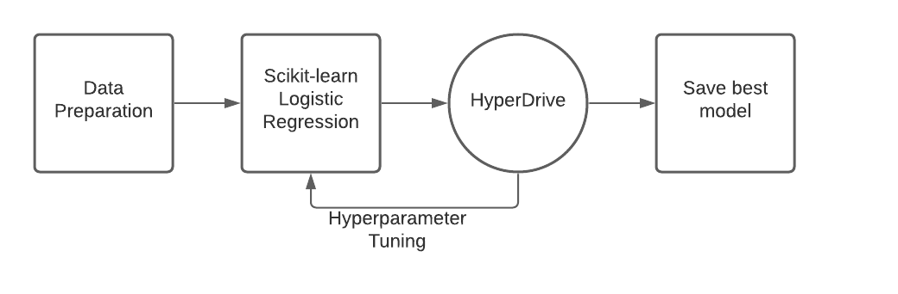
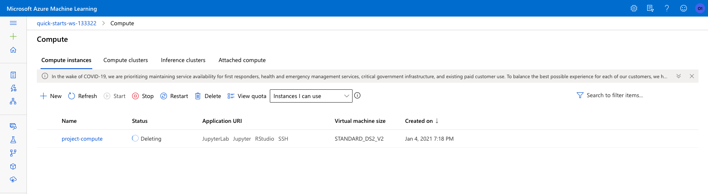

# Optimizing an ML Pipeline in Azure

## Overview
This project is part of the Udacity Azure ML Nanodegree.
In this project, we build and optimize an Azure ML pipeline using the Python SDK and a provided Scikit-learn model.
This model is then compared to an Azure AutoML run.

## Summary

### **Problem Statement**
This project uses the [UCI Bank Marketing Dataset](https://archive.ics.uci.edu/ml/datasets/Bank+Marketing) that contains data about banking clients, which include personal details of clients like age, job, marital status etc and details regarding maketing campaigning.
The goal is to predict whether the client will subscribe a term deposit or not, thus making it a binary classification problem with two classes - *'yes'* and *'no'*.

### **Solution Overview**
The project consists of solving the problem using two different methods:  
**Method 1:** Train a Scikit-learn Logistic Regression model with optmized hyperparameter tuning using HyperDrive 
**Method 2:** Use AutoML to build and optimize a model
The results of the above methods are then compared. 

The best performing model was the **Voting Ensemble** model selected through AutoML, which gave an accuracy of 0.91767.   
The Logistic Regression model with hyperparameters selected through HyperDrive gave an accuracy of 9.90996.  

## Scikit-learn Pipeline
**Explain the pipeline architecture, including data, hyperparameter tuning, and classification algorithm.**

### **Data Preparation**
A *TabularDataset* is created using *Tabular DatasetFactory*. The data is then cleaned and one hot encoded, and finally split into train and test sets. 

### **Code Scikit-learn Logistic Regression Model** 
The Logistic regression model is created. The model requires two hyperparameters: **C**, which is the inverse of regularization strength and **max-iter**, which is the maximum number of iterations to converge.  The Logistic Regression classification algorithm uses a sigmoid function to model the probability of a set of binary classes (yes/no). In any Machine Learning model, there is a chance of overfitting, which is a phenomenon where the model becomes 'too comfortable' with the training data that it does not generalize well. Regularization combats overfitting by making the model coefficients smaller. Thus larger C means less regularization and smaller C means more regularization.  
Accuracy is the primary metric here and that is saved in the run log.

### **HyperDrive Configuration** 
HyperDrive is configured with the estimator, parameter sampler, early termination policy, primary metric name & goal, maximum total runs and maximum concurrent runs.    

**Parameter Sampling** 
The parameter sampling method chosen for this experimnent is Random Sampling. Randing Sampling supports both discrete and continuous hyperparameters. 
Random sampling also supports early termination of low-performance runs. For each of the hyperparameters, hyperparameter space is defined. In this experiment,
1. **C (inversion of regularization strength)**  
    `uniform (0.01, 1.00)` 
    This returns values uniformly distributed between 0.01 and 1.00
2. **max-iter (maximum number of iterations)**  
    `choice (100, 200, 300, 400, 500)`  
    This returns a value chosen among given discrete values 100, 200, 300, 400, 500.  

Hyperparameter values are randomly selected from the defined search space.

**Early Termination Policy**  
Automatically terminating poorly performing runs with an early termination policy improves computational efficiency.
In this experiment, Bandit policy is used. Bandit policy is based on slack factor/slack amount and evaluation interval. Bandit terminates runs where the primary metric is not within the specific slack factor/slack amount comapred to the best performing run. 
The primary metric for the experiment is accuracy.

The following configuration parameters were specified:
1. `evaluation_interval=2` 
    The policy is applied every other time the training script logs the primary metric.
2. `delay_evaluation=5` 
    The first policy evaluation is delayed to avoid premature termination.
3. `slack_factor=0.1` 
    Any run whose best metric run is less than (1/(1+0.1)) or 91% of the best performing run will be terminated. 

The Hyperdrive run is then submitted to the experiment. Once the run is completed, the best metrics are obtained and the model from the best run is registered.

### **Save Model** 
Once the run is completed, the best metrics are obtained and the model from the best run is registered.

## AutoML
**In 1-2 sentences, describe the model and hyperparameters generated by AutoML.**

AutoML generated a **VotingEnsemble model** as the best fitted model, based on the primary metric accuracy. 
The VotingEnsemble model defines an ensemble created from previous AutoML iterations that implements soft voting. The hyperparameters generated are the classifiers for the ensemble and the weights. 

`weights=[0.4666666666666667, 0.2, 0.06666666666666667, 0.06666666666666667, 0.06666666666666667, 0.06666666666666667, 0.06666666666666667]`
                                                        
                                                                                                      

## Pipeline comparison

The custom-coded Logistic Regression used HyperDrive to optimize the hyperparameters, while the Voting Ensemble was selected as the optimal model by the AutoML run.  
The **Voting Ensemble** model gave an accuracy of **0.91776**, while the **Logistic Regression** model gave an accuracy of **0.90996**. 
The difference in accuracy is justified, because there is a difference in the design in each of those models. While the Logistic Regression model approximates the probability to a sigmoid function, the Voting Ensemble model combines predictions from multiple models through voting. This acheives better performance than a single model.  
Although using HyperDrive finds the optimal values for hyperparameters for a given model, AutoML automates the iterative process of finding the optimal model for a given datset and target metric.

## Future work

### HyperDrive Experiment
For future experiments, different parameter sampling can be tried out with varying hyperparameter space to learn about how they affect the performance of HyperDrive. There are different early termination policies which can be explored further.

### AutoML Experiment
The AutoML run gave an 'Imbalanced Data' warning. This is because the the classes within the datasets are not represented equally. AutoML has different features for dealing with AutoML data and that can be leveraged. 
The Automatic Featurization feature in AutoML can be further explored. Future experiments can focus on comparing the results of passing clean data and passing data as it is without cleaning. 

## Proof of cluster clean up

